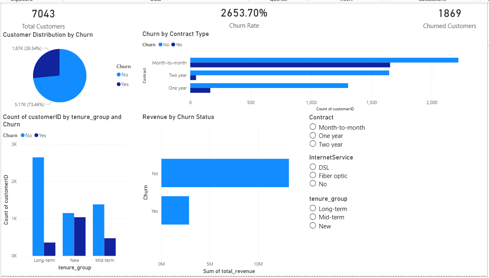

# 📊 Customer Churn Analysis using Power BI, SQL,  & Python

## 📌 Project Overview

This project focuses on analyzing customer churn behavior in a telecom dataset. The objective is to identify patterns and factors that lead to customer churn and provide actionable insights to improve customer retention and business decision-making.

## 🛠️ Tools & Technologies Used

- Excel (Data Cleaning, Duplicate Handling, Initial Exploration)
- Python (Pandas, Data Cleaning & Feature Engineering)
- SQL (Data Analysis & Querying)
- Power BI (Interactive Dashboard Visualization)

## 📂 Dataset

- Telecom Customer Churn Dataset  
- Contains 7000+ customer records  
- Includes customer demographics, services, tenure, and billing details  

## ⚙️ Steps Performed

### 1. Data Cleaning (Excel & Python)

- Checked and removed duplicate records using Excel  
- Handled missing and inconsistent values  
- Converted data types (e.g., `TotalCharges` to numeric)  
- Performed initial data validation and exploration in Excel  

### 2. Feature Engineering (Python)

- Created new features:
  - `churn_flag` (converted Yes/No to 1/0)  
  - `tenure_group` (segmented customers into New, Mid-term, Long-term)  
- Prepared clean dataset for analysis  

### 3. SQL Analysis

- Calculated total customers and churned customers  
- Computed churn rate  
- Analyzed revenue distribution by churn status  
- Identified customer trends across contract types  

### 4. Power BI Dashboard

#### KPI Cards:
- Total Customers  
- Churn Rate  
- Churned Customers  

#### Visualizations:
- Pie Chart → Customer Distribution by Churn  
- Bar Chart → Churn by Contract Type  
- Column Chart → Churn by Tenure Group  
- Bar Chart → Revenue by Churn Status  

#### Filters (Slicers):
- Contract  
- Internet Service  
- Tenure Group  

## 📊 Key Insights

- Customers with **month-to-month contracts** have the highest churn rate  
- **New customers** are more likely to churn compared to long-term customers  
- Customers who churn contribute significantly **less revenue**  
- Long-term contracts show stronger customer retention patterns  

## 💡 Business Recommendations

- Encourage customers to switch to long-term contracts to reduce churn  
- Improve onboarding and engagement strategies for new customers  
- Provide targeted retention offers for high-risk segments  
- Focus marketing efforts on converting short-term users into loyal customers  

## 📸 Dashboard Preview

## 📁 Project Structure
customer-churn-analysis/
│
├── data/
│ └── churn_cleaned.csv
│
├── python/
│ └── churn_analysis.ipynb
│
├── sql/
│ └── churn_queries.sql
│
├── dashboard/
│ └── dashboard.png
│
└── README.md

## 🚀 Conclusion

This project demonstrates end-to-end data analysis including data cleaning, SQL-based insights, and interactive dashboard creation using Power BI. It provides meaningful insights that can help businesses reduce churn and improve customer retention strategies.

